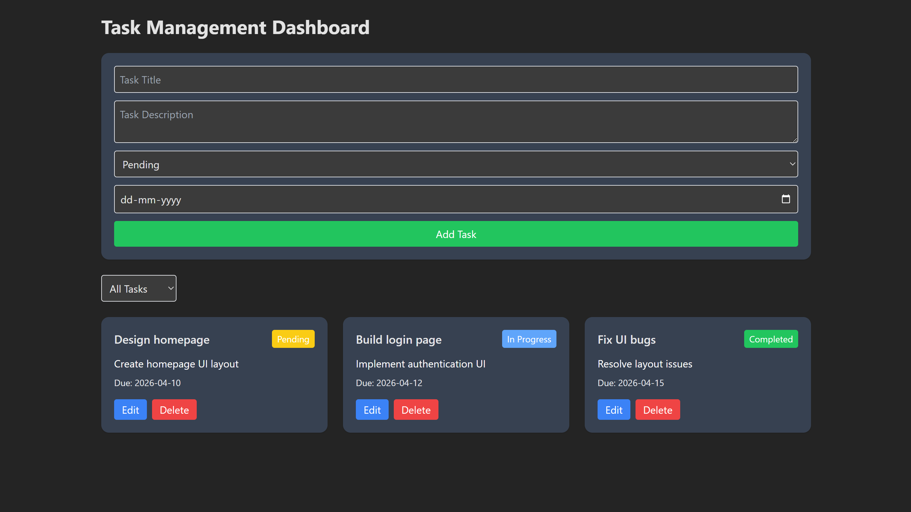
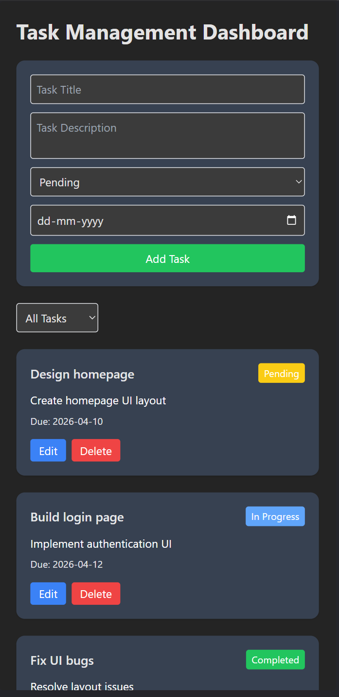

# Task Management Dashboard

## Project Overview

The **Task Management Dashboard** is a React-based web application that allows users to manage tasks efficiently.
Users can **create, update, delete, and filter tasks** through a clean and responsive interface.

This project demonstrates the use of **React functional components, hooks, state management, and component-based architecture** to build a structured frontend application.

---

## Technologies Used

* React.js
* Vite
* JavaScript (ES6+)
* Tailwind CSS
* React Hooks (useState, useEffect)

---

## Features Implemented

### Task Management

* View all tasks in a dashboard
* Add new tasks
* Edit existing tasks
* Delete tasks

### Task Information

Each task contains:

* Task Title
* Task Description
* Task Status (Pending / In Progress / Completed)
* Due Date

### Dashboard Features

* Status badge for each task
* Filter tasks by status
* Dynamic UI updates
* Controlled form inputs
* Basic form validation

---

## Folder Structure

```
src
│
├── components
│   ├── TaskCard.jsx
│   ├── TaskForm.jsx
│   └── FilterBar.jsx
│
├── pages
│   └── Dashboard.jsx
│
├── services
│   └── api.js
│
├── data
│   └── tasks.json
│
├── App.jsx
└── main.jsx
```

---

## Setup Instructions

### 1. Clone the repository

```
git clone https://github.com/sunil0336/task-management
```

### 2. Navigate to the project folder

```
cd task-management-dashboard
```

### 3. Install dependencies

```
npm install
```

### 4. Run the development server

```
npm run dev
```

The application will run at:

```
http://localhost:5173
```

---

## Screenshots

### Dashboard View


### Responsive Layout


---

## Author

Sunil Rathod
MSc Computer Science – Fergusson College Pune
